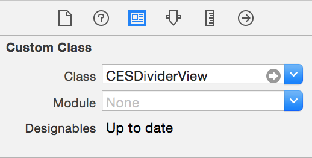
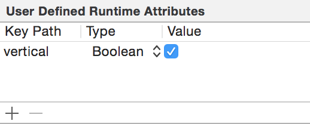

# CESDividerView

[](http://cocoadocs.org/docsets/CESDividerView)
[](http://cocoadocs.org/docsets/CESDividerView)
[](http://cocoadocs.org/docsets/CESDividerView)

Simplifies the creation of a one pixel line on any device.

* Horizonal or vertical
* Works with or without autolayout.
* Can be created programmatically or in storyboards/xibs

## Example

To run the example project, run `pod try CESDividerView`.

## Usage

### Storyboard/Xib
1. Add a UIView
2. In the Identity Inspector (⌥⌘3), set the class to `CESDividerView`

	
3. To make a vertical line, in the Attributes Inspector (⌥⌘4), set "Vertical" to On

	

### Programmatically

Create a new instance and set the type to `CESDividerViewTypeHorizontal` or `CESDividerViewTypeVertical`. This can be done using `-initWithType:`

```objc
CESDividerView *dividerView = [[CESDividerView alloc] initWithType:CESDividerViewTypeVertical];
```
 or by setting the `type` property.
```objc
dividerView.type = CESDividerViewTypeHorizontal;
```

## Installation

CESDividerView is available through [CocoaPods](http://cocoapods.org). To install
it, simply add the following line to your Podfile:

    pod "CESDividerView"

## License

CESDividerView is available under the MIT license. See the LICENSE file for more info.

